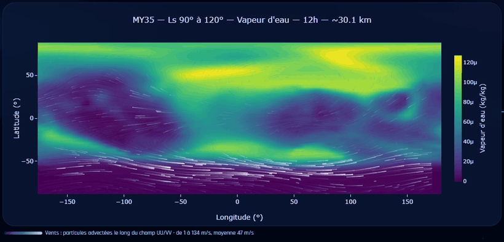

# Mars Climate Viewer

[](https://github.com/ludvdber/MCV/actions/workflows/ci.yml)
[](https://scorecard.dev/viewer/?uri=github.com/ludvdber/MCV)
[](https://github.com/ludvdber/MCV/releases/latest)
[](LICENSE)
[](https://github.com/ludvdber/MCV)
[](https://adoptium.net/)
[](https://mars.ludovdb.be)

*English version: [README.md](README.md)*

Mars Climate Viewer ouvre l'atmosphère martienne dans un navigateur. Il donne
accès au modèle climatique GEM-Mars de l'Institut royal d'Aéronomie Spatiale de
Belgique (IASB-BIRA) sous forme de cartes, de profils verticaux, de coupes et
d'animations diurnes, en lisant les fichiers NetCDF de l'institut là où ils sont
déjà : rien n'est dupliqué, converti ni pré-calculé.

**Essayez-le sur [mars.ludovdb.be](https://mars.ludovdb.be)** : sans compte et
sans installation.


Onze types de visualisation, une console qui relie jusqu'à quatre vues entre
elles, des exports en CSV, PNG, SVG et NetCDF, des permaliens qui reproduisent
une figure à l'identique, et une interface en cinq langues.

Les fichiers sont **lus partiellement** : chaque requête ne lit que la tranche,
le pas de temps ou le niveau dont elle a besoin, si bien qu'une archive de
plusieurs téraoctets reste où elle est et ne coûte que quelques kilooctets de
lecture disque par vue.

| Composant | Technologies |
|---|---|
| Backend | Spring Boot 4.1, Java 21, NetCDF-Java (cdm-core 5.9), Gradle 9 |
| Frontend | React 19, Vite 8, Plotly.js, Three.js, MUI 9, i18next |

---

## Visualisations

| Vue | Route | Contenu |
|---|---|---|
| Slice 2D | `/slice` | carte lat/lon à un pas de temps et un niveau d'altitude |
| Animation | `/animation` | cycle diurne complet, 48 images |
| Série temporelle | `/timeseries` | une variable au fil de la journée, en un point |
| Profil vertical | `/profile` | une variable sur toute la colonne d'air |
| Coupe verticale | `/crosssection` | altitude × latitude (méridionale) ou × longitude (zonale) |
| Moyenne zonale | `/zonalmean` | moyenne longitudinale, altitude × latitude |
| Hovmöller | `/hovmoller` | diagramme espace × temps |
| Profil temporel | `/temporal-profile` | altitude × heure locale au-dessus d'un point |
| Rose des vents | `/windrose` | distribution direction/vitesse du vent en un point |
| Différence | `/difference` | carte d'anomalies entre deux jeux de données |
| Exploration | `/explore` | console : jusqu'à 4 vues liées, sonde, statistiques de région, sessions |

Toutes les vues offrent permaliens, export CSV, export PNG/SVG, échelle log₁₀ et choix de palette. L'interface est disponible en anglais, français, néerlandais, allemand et espagnol.

La console d'exploration réunit jusqu'à quatre vues côte à côte, reliées par une sonde partagée et une même sélection de région, ce qui permet de lire un même point sur plusieurs diagnostics à la fois :


Sur n'importe quelle carte, les vents peuvent s'afficher en **particules advectées** le long du champ UU/VV. La couleur et l'épaisseur des traînées suivent la vitesse locale, et la légende donne les bornes de l'échelle ainsi que la moyenne du champ :



En grille, chaque vue anime **son propre** champ, à son altitude et à son instant : quatre cartes côte à côte affichent quatre vents différents, chacune annonçant ses bornes sous la carte. Un bouton de la barre d'outils ramène l'animation à la seule vue active, ce qui est le réglage par défaut sur téléphone, où quatre canvas animés coûtent cher pour des cartes de la taille d'une vignette.

---

## Prérequis

| Prérequis | Version | Nécessaire pour |
|---|---|---|
| **Java** | 21 ou plus | exécuter l'application |
| **Node.js** | 20 ou plus | compiler le frontend uniquement — jamais requis sur le serveur de production |
| **Données GEM-Mars** | fichiers `.nc` | voir [Configuration](#configuration) |

---

## Installation

```bash
git clone <url-du-depot>
cd mars-visualizer
cd frontend && npm install && cd ..
```

`./gradlew` ne nécessite aucune installation locale de Gradle (wrapper inclus).

---

## Configuration

L'application a besoin de deux dossiers de données. Renseignez-les **avant le premier démarrage** : sinon l'application refuse de démarrer avec un message explicite nommant le chemin manquant.

| Propriété | Variable d'environnement | Défaut | Description |
|---|---|---|---|
| `netcdf.mean.path` | `NETCDF_MEAN_PATH` | `/data/gem-mars/mean` | Dossier des fichiers `.nc` moyennés (48 pas d'heure locale). La valeur par défaut est un chemin neutre : le démarrage échoue avec un message explicite tant qu'elle n'est pas renseignée |
| `netcdf.individual.path` | `NETCDF_INDIVIDUAL_PATH` | `/data/gem-mars/individual` | Dossier contenant un sous-dossier par année martienne (`34/`, `35/`, …) |
| `netcdf.individual.my_base` | — | `34` | Première année martienne présente dans ce dossier ; les suivantes sont détectées automatiquement |
| `server.port` | `SERVER_PORT` | `8080` | Port HTTP servant l'API et l'interface |
| `site.public-url` | `SITE_PUBLIC_URL` | *(vide)* | Adresse publique du site, utilisée par `sitemap.xml`, `robots.txt` et les balises canonical / Open Graph. Laissée vide, elle est déduite de la requête, ce qui est déjà juste derrière un reverse proxy. Voir [DEPLOYMENT.fr.md](DEPLOYMENT.fr.md#ladresse-publique-du-site) |
| `ratelimit.requests-per-minute` | — | `120` | Limite de requêtes par IP |
| `ratelimit.export-per-minute` | — | `20` | Limite d'exports par IP (CSV/NetCDF) |
| `cors.allowed-origin` | — | `http://localhost:5173` | Utilisé uniquement si le frontend est servi séparément (mode développement) |
| `server.tomcat.remoteip.internal-proxies` | `TRUSTED_PROXIES` | loopback + plages privées | Proxys dont le `X-Forwarded-For` est cru. À laisser tel quel pour un proxy sur la même machine ou le même réseau ; voir [DEPLOYMENT.fr.md](DEPLOYMENT.fr.md#derrière-un-reverse-proxy) |

**Les partages réseau sont pris en charge.** Dans un fichier `.properties`, `\` est un caractère d'échappement : doublez chaque antislash ou utilisez des slashes — les deux formes fonctionnent pour les chemins UNC :

```properties
netcdf.mean.path=//srv-iasb/gem-mars/mean          # UNC, slashes (le plus simple)
netcdf.mean.path=\\\\srv-iasb\\gem-mars\\mean      # UNC, antislashes échappés
netcdf.mean.path=/mnt/gem-mars/mean                # montage NFS/CIFS Linux
```

Un chemin injoignable est détecté au démarrage en quelques secondes et l'application refuse de démarrer plutôt que de servir un catalogue vide. Un fichier qui disparaît en cours d'exécution renvoie un HTTP 404 pour ce jeu de données ; le reste de l'application continue de fonctionner.

**Le catalogue est construit une seule fois, au démarrage.** Un fichier `.nc` ajouté pendant que l'application tourne reste invisible, y compris pour une requête qui le nommerait directement : il faut relancer l'application. La marche à suivre complète, avec le cas particulier des fichiers ajoutés dans un sous-dossier existant de `individual/`, est décrite dans [DEPLOYMENT.fr.md](DEPLOYMENT.fr.md#ajouter-de-nouvelles-données).

La configuration peut être fournie de trois manières (par priorité décroissante) : arguments de ligne de commande, variables d'environnement, ou fichier `config/application.properties` placé à côté du JAR. Un modèle commenté bilingue est fourni dans [`config/application.properties`](config/application.properties).

**Vous n'avez pas besoin d'aller le chercher.** Au premier démarrage, si aucune configuration n'existe ni à plat à côté du JAR ni dans un dossier `config/`, l'application dépose ce modèle elle-même et annonce son chemin absolu dans la console. Et quand un chemin manque ou est faux, le refus de démarrer prend la forme d'un bloc `APPLICATION FAILED TO START` bilingue qui dit ce qui ne va pas d'un côté et quoi corriger de l'autre, sans trace de pile. Les deux sont montrés dans [DEPLOYMENT.fr.md](DEPLOYMENT.fr.md#installer).

---

## Lancement

### Développement (rechargement à chaud)

Deux serveurs en parallèle :

```bash
./gradlew bootRun                 # backend sur :8080
cd frontend && npm run dev        # frontend sur :5173, proxy /api vers :8080
```

Ouvrir http://localhost:5173.

Les chemins de données de votre machine se mettent dans `config/application-local.properties`, un fichier non versionné que `config/application.properties` importe automatiquement. Il évite d'avoir à modifier le modèle de configuration livré, qui ne doit contenir que des chemins d'exemple neutres :

```properties
netcdf.mean.path=D:/mars-data/mean
netcdf.individual.path=D:/mars-data/individual
```

### Production (JAR unique)

```bash
./gradlew build                                    # compile frontend + backend, exécute les tests
java -jar build/libs/mars-visualizer-0.0.1-SNAPSHOT.jar
```

Le JAR contient l'interface et l'API ; ouvrir http://localhost:8080.

### Paramètres de lancement

Toute propriété peut être passée en ligne de commande avec `--<propriété>=<valeur>`, ou via une variable d'environnement :

```bash
# Port et chemins de données personnalisés
java -jar mars-visualizer.jar \
  --server.port=9000 \
  --netcdf.mean.path=//srv-iasb/gem-mars/mean \
  --netcdf.individual.path=//srv-iasb/gem-mars/individual

# Équivalent avec des variables d'environnement
SERVER_PORT=9000 \
NETCDF_MEAN_PATH=/mnt/gem-mars/mean \
NETCDF_INDIVIDUAL_PATH=/mnt/gem-mars/individual \
java -jar mars-visualizer.jar

# Journalisation verbeuse pour un premier déploiement
java -jar mars-visualizer.jar --logging.level.com.mars.visualizer=DEBUG

# N'écouter que sur une interface (derrière un reverse proxy)
java -jar mars-visualizer.jar --server.address=127.0.0.1
```

Installation serveur, service systemd et reverse proxy : **[DEPLOYMENT.fr.md](DEPLOYMENT.fr.md)**.

---

## API REST

Tous les endpoints répondent en JSON et valident leurs paramètres (HTTP 400 avec message localisé sur une valeur invalide, 404 sur un jeu de données inconnu).

| Endpoint | Description |
|---|---|
| `GET /api/catalog` | Catalogue des jeux de données MEAN |
| `GET /api/catalog/individual` | Catalogue des années martiennes individuelles |
| `GET /api/data/slice` | Grille 2D lat/lon |
| `GET /api/data/timeseries` | 48 valeurs en un point |
| `GET /api/data/animation` | 48 images du cycle diurne |
| `GET /api/data/profile` | Profil vertical en un point |
| `GET /api/data/crosssection` | Coupe méridionale ou zonale |
| `GET /api/data/zonalmean` | Moyenne zonale (altitude × latitude) |
| `GET /api/data/hovmoller` | Diagramme de Hovmöller (espace × temps) |
| `GET /api/data/temporal-profile` | Profil temporel (altitude × temps) |
| `GET /api/data/difference` | Différence entre deux jeux de données |
| `GET /api/data/wind` | Champ de vent sous-échantillonné (UU/VV) |
| `GET /api/data/windrose` | Rose des vents en un point |
| `GET /api/data/transect` | Transect grand-cercle entre deux points |
| `GET /api/data/tides` | Marées thermiques (harmoniques diurne et semi-diurne) |
| `GET /api/data/altitudes` | Niveaux d'altitude disponibles pour une variable |
| `GET /api/export/csv/*` | Export CSV par type de vue |
| `GET /api/export/netcdf/slice` | Export NetCDF d'une slice |

Paramètres communs : `dataset` (identifiant du catalogue), `variable` (code scientifique, ex. `TT`, `H2O`, `P0`), `time` (0–47, index d'heure locale par demi-heures), `altitude` (0–102, index de niveau du modèle), `latitude` (−90…90), `longitude` (−180…180).

Exemple :

```bash
curl "http://localhost:8080/api/data/slice?dataset=<id>&variable=TT&time=24&altitude=49"
```

---

## Build et tests

| Commande | Effet |
|---|---|
| `./gradlew bootRun` | Backend sur :8080 (reconstruit le frontend d'abord) |
| `./gradlew build` | Frontend, compilation, tests, JAR dans `build/libs/` |
| `./gradlew bootJar` | JAR seul, sans les tests |
| `./gradlew test` | Suite JUnit 5 et rapport de couverture |
| `cd frontend && npm run dev` | Serveur Vite sur :5173, rechargement à chaud |
| `cd frontend && npm run test` | Suite Vitest (jsdom) |
| `cd frontend && npm run test:e2e` | Suite de bout en bout dans un vrai Chromium |
| `cd frontend && npm run lint` | Vérification ESLint |

Ce que prouve chaque suite, ce qu'elle ne peut pas voir, les chiffres de
couverture et l'intégration continue :
**[docs/DEVELOPMENT.fr.md](docs/DEVELOPMENT.fr.md)**.

---

## Documentation

| Fichier | Contenu |
|---|---|
| [DEPLOYMENT.fr.md](DEPLOYMENT.fr.md) | Installation serveur, service systemd, reverse proxy |
| [docs/DEVELOPMENT.fr.md](docs/DEVELOPMENT.fr.md) | Suites de tests, couverture, intégration continue |
| [CHANGELOG.fr.md](CHANGELOG.fr.md) | Ce que contient chaque version publiée, et ce qu'elle a corrigé |
| [config/application.properties](config/application.properties) | Modèle de configuration commenté |
| [deploy/](deploy/) | Unité systemd et bloc Nginx prêts à copier, avec les trois variantes réseau |

---

## Licence et réutilisation

Publié sous [licence MIT](LICENSE), © 2026 Ludovic Vanden Berghe.

Vous pouvez utiliser, modifier et redistribuer ce code, y compris
commercialement, à une condition : la mention de copyright et le texte de la
licence voyagent avec lui. Concrètement, gardez le fichier `LICENSE` dans toute
copie ou portion substantielle du code source.

Si vous construisez quelque chose dessus, un lien vers
[github.com/ludvdber/MCV](https://github.com/ludvdber/MCV) n'est pas obligatoire,
mais il fait toujours plaisir.

Données GEM-Mars produites par l'Institut royal d'Aéronomie Spatiale de Belgique
(IASB-BIRA).
