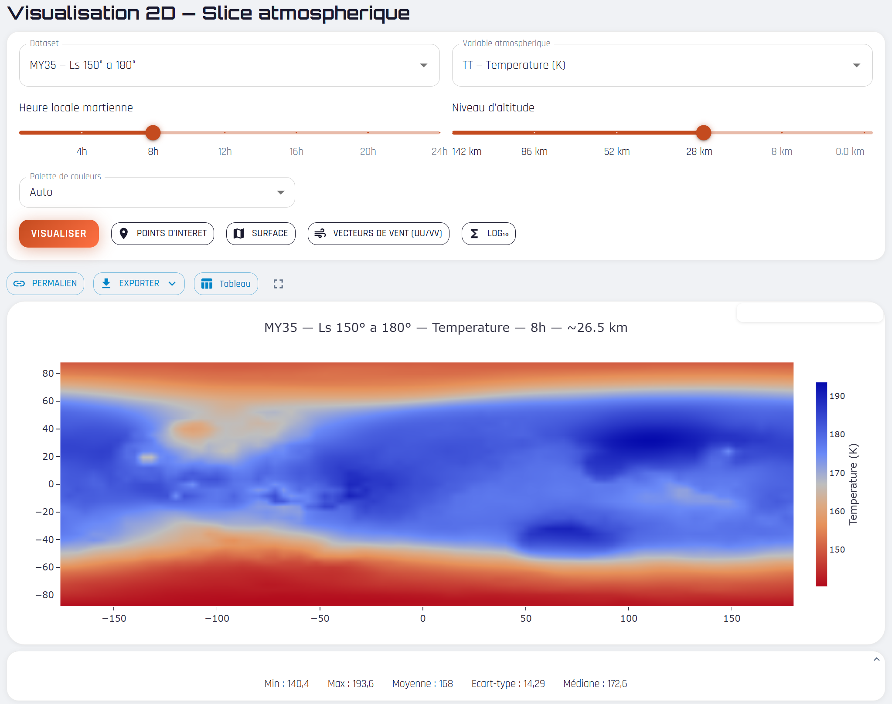
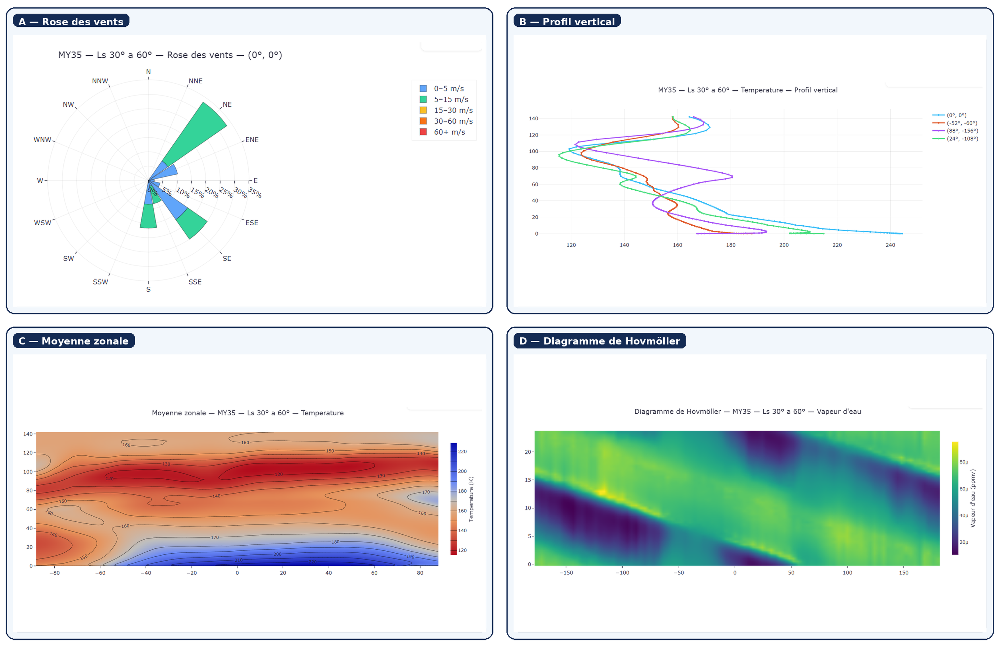
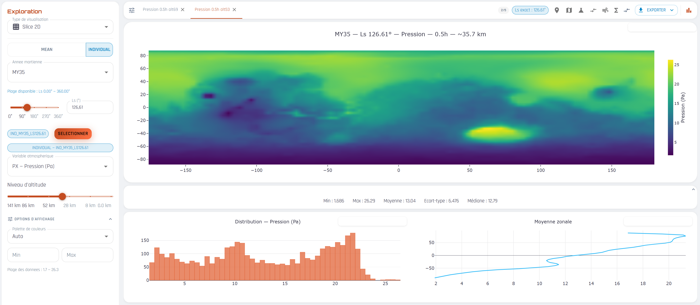

# Mars Climate Viewer

Visualisation web des données atmosphériques martiennes issues du modèle **GEM-Mars**.

**TFE Bachelier en Informatique - ISFCE 2026**



*La page de visualisation 2D. On choisit le jeu de données, la variable, l'instant et l'altitude, puis la carte interactive s'affiche avec ses statistiques, son permalien et ses options d'export.*

---

## À propos

Mars Climate Viewer (MCV) rend accessibles les données climatiques de Mars produites par le modèle atmosphérique GEM-Mars à l'Institut royal d'Aéronomie Spatiale de Belgique (IASB).

Ces simulations sont stockées dans des fichiers NetCDF, un format scientifique puissant mais peu commode : pour consulter un résultat, il faut généralement connaître la structure des fichiers, écrire un script Python ou passer par un logiciel spécialisé comme Panoply ou ParaView. Ces outils sont parfaits pour une analyse poussée, mais lourds pour une consultation rapide. MCV comble ce vide. Depuis un simple navigateur, on choisit un jeu de données, une variable, un instant, une altitude ou une zone, et on obtient une visualisation interactive.

Le cœur technique tient en une idée : **l'application ne télécharge jamais un fichier complet**. Pour chaque demande, le serveur lit uniquement le sous-ensemble réellement nécessaire (un slice, un profil, un pas de temps) directement sur le disque via `variable.read(origin, shape)`, puis renvoie une réponse légère. Les données volumineuses restent protégées côté serveur, et l'interface reste fluide quelle que soit la taille des simulations.

MCV ne cherche pas à remplacer les outils scientifiques experts. C'est une solution intermédiaire : assez simple pour ouvrir les données GEM-Mars à différents profils d'utilisateurs, tout en conservant les informations nécessaires à une interprétation correcte.

---

## Points techniques notables

- **Lecture partielle des NetCDF** : seul le sous-ensemble demandé est lu sur le disque, jamais le fichier entier.
- **JAR autonome** : `./gradlew build` compile le frontend et l'embarque dans le JAR du backend. Un seul artefact à déployer, frontend et API servis sur la même origine.
- **Internationalisation** : 5 langues (anglais, français, néerlandais, allemand, espagnol) avec détection automatique de la langue du navigateur.
- **Thème clair / sombre** persistant, et interface installable en PWA (mise en cache des assets pour un chargement rapide).
- **Permaliens** : chaque vue génère une URL partageable qui restaure exactement les paramètres choisis.
- **Historique récent** des visualisations (stocké localement, avec épinglage des vues favorites).
- **Exports** CSV (toutes les vues) et NetCDF (slice), pour reprendre les données dans Python ou Matlab.
- **Backend robuste** : threads virtuels (Java 21 / Project Loom), compression gzip, limitation de débit par IP, arrêt gracieux, validation systématique des paramètres.
- **Cache client** (5 min) sur les appels API pour éviter les requêtes redondantes.

---

## Stack technique

| Couche | Technologies |
|---|---|
| **Backend** | Spring Boot 4.1.0, Java 21, NetCDF-Java (cdm-core 5.9.1), Gradle 9 |
| **Frontend** | React 19, Vite 8, Plotly.js, Three.js / React-Three-Fiber, Material-UI 7, i18next, Axios |

---

## Structure du projet

```
mars-visualizer/
├── src/main/java/          # Backend Spring Boot (API REST, lecture NetCDF)
├── frontend/src/
│   ├── components/         # Composants React réutilisables (viewers, selectors, UI)
│   ├── hooks/              # Hooks personnalisés (useVisualizationPage, usePlotRef, …)
│   ├── pages/              # Pages de visualisation (Slice, Animation, Profile, …)
│   ├── utils/              # Utilitaires (palettes, export, analyse, URL)
│   ├── context/            # Contextes globaux (Mars, thème, toasts)
│   ├── i18n/               # Traductions (5 langues)
│   └── services/           # Client API (Axios, cache)
└── build.gradle
```

---

## Installation

### Prérequis
- Java 21
- Node.js 20+
- Jeux de données NetCDF dans les répertoires configurés (voir [Configuration](#configuration))

### Build
```bash
cd frontend && npm install && cd ..
./gradlew build
```

Le build compile le frontend, l'embarque dans les ressources statiques, puis produit un JAR autonome dans `build/libs/`.

---

## Lancement

### En développement
```bash
# Backend (port 8080)
./gradlew bootRun

# Frontend (port 5173, proxy /api vers :8080)
cd frontend && npm run dev
```

### En production
```bash
java -jar build/libs/mars-visualizer-0.0.1-SNAPSHOT.jar
```
Le JAR sert à la fois l'API et l'interface sur le port 8080.

---

## Configuration

Les chemins par défaut pointent vers un poste de développement Windows. En production, on les surcharge par variables d'environnement.

| Variable | Rôle | Défaut |
|---|---|---|
| `NETCDF_MEAN_PATH` | Dossier des fichiers NetCDF MEAN | `C:/Users/User/Desktop/mars-data/mean` |
| `NETCDF_INDIVIDUAL_PATH` | Dossier des fichiers NetCDF par année martienne | `C:/Users/User/Desktop/mars-data/individual` |
| `SERVER_PORT` | Port HTTP | `8080` |

Autres réglages utiles dans `application.properties` : limitation de débit (`ratelimit.requests-per-minute`), origine CORS autorisée (`cors.allowed-origin`, utile seulement quand le frontend est servi séparément en dev), et `netcdf.individual.my_base` (première année martienne présente dans le dossier individual).

---

## Fonctionnalités



*Quatre des onze types de vues proposées : rose des vents, profil vertical, moyenne zonale et diagramme de Hovmöller.*

| Page | Description |
|---|---|
| **Slice 2D** (`/slice`) | Carte heatmap lat/lon à un pas de temps et une altitude |
| **Animation** (`/animation`) | Cycle diurne animé (48 frames) |
| **Série temporelle** (`/timeseries`) | Courbe diurne en un point géographique |
| **Profil vertical** (`/profile`) | Valeur d'une variable sur tous les niveaux d'altitude |
| **Coupe verticale** (`/crosssection`) | Coupe méridionale ou zonale (heatmap altitude × coordonnée) |
| **Moyenne zonale** (`/zonalmean`) | Moyenne tout autour de la planète, selon l'altitude et la latitude |
| **Diagramme de Hovmöller** (`/hovmoller`) | Un motif suivi à la fois dans l'espace et dans le temps sur une seule image |
| **Profil temporel** (`/temporal-profile`) | Altitude et heure de la journée réunies au-dessus d'un point |
| **Rose des vents** (`/windrose`) | Directions et forces du vent en un point au fil de la journée |
| **Différence** (`/difference`) | Comparaison de deux datasets, affichée sous forme de carte d'écarts |
| **Exploration** (`/explore`) | Comparaison multi-variables, multi-datasets |

Toutes les pages supportent : permaliens, export CSV, export PNG/SVG (Plotly), échelle logarithmique (log₁₀) et choix de palette de couleurs.



*La page Exploration : comparer plusieurs variables et plusieurs jeux de données côte à côte, avec distribution et moyenne zonale.*

---

## API REST

### Données

| Endpoint | Description |
|---|---|
| `GET /api/catalog` | Catalogue des datasets MEAN |
| `GET /api/catalog/individual` | Catalogue des années martiennes individuelles |
| `GET /api/data/slice` | Extraction 2D [lat][lon] |
| `GET /api/data/timeseries` | Série temporelle (48 pas de temps) |
| `GET /api/data/animation` | 48 frames pour animation diurne |
| `GET /api/data/profile` | Profil vertical en un point |
| `GET /api/data/crosssection` | Coupe verticale méridionale ou zonale |
| `GET /api/data/zonalmean` | Moyenne zonale (altitude × latitude) |
| `GET /api/data/hovmoller` | Diagramme de Hovmöller (espace × temps) |
| `GET /api/data/temporal-profile` | Profil temporel (altitude × temps) |
| `GET /api/data/difference` | Différence entre deux datasets |
| `GET /api/data/wind` | Champ de vent sous-échantillonné (UU/VV) |
| `GET /api/data/windrose` | Rose des vents en un point |
| `GET /api/data/altitudes` | Niveaux d'altitude disponibles pour une variable |

La documentation interactive complète est exposée via Swagger UI sur `/swagger-ui` (et `/api-docs` pour le JSON OpenAPI).

### Exports CSV

| Endpoint | Description |
|---|---|
| `GET /api/export/csv/slice` | Export CSV d'un slice |
| `GET /api/export/csv/timeseries` | Export CSV d'une série temporelle |
| `GET /api/export/csv/profile` | Export CSV d'un profil vertical |
| `GET /api/export/csv/crosssection` | Export CSV d'une coupe verticale |
| `GET /api/export/csv/zonalmean` | Export CSV d'une moyenne zonale |
| `GET /api/export/csv/hovmoller` | Export CSV d'un diagramme de Hovmöller |
| `GET /api/export/csv/temporal-profile` | Export CSV d'un profil temporel |
| `GET /api/export/csv/difference` | Export CSV d'une différence |
| `GET /api/export/csv/windrose` | Export CSV d'une rose des vents |

### Export NetCDF

| Endpoint | Description |
|---|---|
| `GET /api/export/netcdf/slice` | Export NetCDF d'un slice (format scientifique pour Python/Matlab) |

---

## Architecture frontend

### Hooks personnalisés

| Hook | Rôle |
|---|---|
| `useVisualizationPage` | Logique commune à toutes les pages : état, restauration d'URL, lancement, raccourcis, historique |
| `usePlotRef` | Ref conteneur viewer + ref synthétique Plotly pour l'export |
| `useRecentHistory` | Historique des visualisations (localStorage, déduplication, épinglage) |
| `useCopyToClipboard` | Copie presse-papier avec retour visuel temporaire |
| `useResolvedColorscale` | Résolution de palette automatique (RdBu pour températures, Viridis sinon) |

### Composants partagés

| Composant | Rôle |
|---|---|
| `VisuToggle` | Bouton toggle outlined/contained réutilisable |
| `PermalienButton` | Bouton permalien avec feedback visuel |
| `StatsBar` | Barre de statistiques (min, max, moyenne, écart-type) |
| `ColorscaleSelector` | Sélecteur de palette Plotly |
| `LocationsLegend` | Légende des points d'intérêt martiens |
| `HistoryDialog` | Boîte de dialogue de l'historique récent |
| `PageLoader` | Indicateur de chargement centré |

---

## Tests

- **Backend** : suite JUnit 5 (services, contrôleurs, validation, exports).
- **Frontend** : Vitest + Testing Library (hooks, historique, restauration des permaliens, scénarios nominaux et non-nominaux).

```bash
./gradlew test                 # tests backend
cd frontend && npm run test    # tests frontend
```

---

## Contexte

Projet développé dans le cadre du Travail de Fin d'Études du Bachelier en Informatique de l'ISFCE (2026), dans la continuité d'un stage à l'IASB consacré à la conversion des sorties brutes de GEM-Mars vers le format NetCDF.
