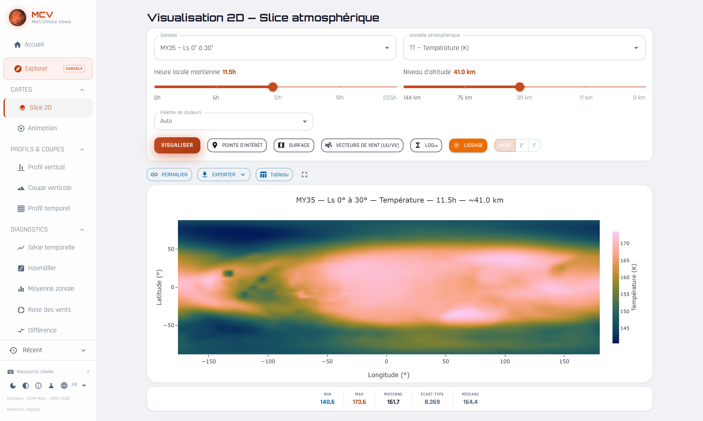
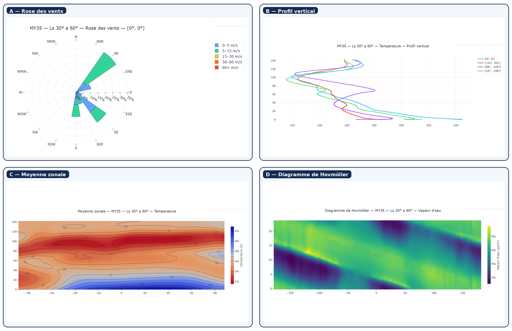
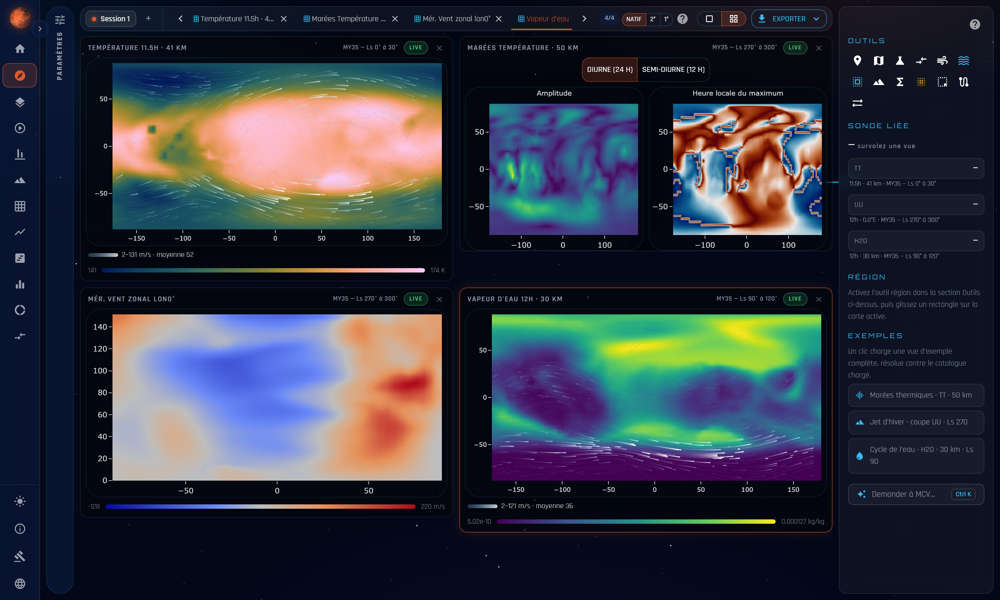

# Mars Climate Viewer

**Le climat de Mars, dans votre navigateur.**

Une interface web qui ouvre les simulations atmosphériques du modèle **GEM-Mars**, sans script Python ni logiciel spécialisé. On choisit un jeu de données, une variable, un instant, une altitude, et la carte interactive s'affiche.




*La page de visualisation 2D. On règle le jeu de données, la variable, l'instant et l'altitude, puis la carte s'affiche avec ses statistiques, son permalien et ses options d'export.*

---

## Pourquoi cet outil

Les simulations du modèle GEM-Mars, produites à l'Institut royal d'Aéronomie Spatiale de Belgique (IASB), décrivent l'atmosphère de Mars heure par heure, du sol jusqu'à la haute atmosphère. Elles sont stockées dans des fichiers NetCDF : un format scientifique très riche, mais peu accueillant. Pour en tirer une simple carte, il faut d'ordinaire connaître la structure des fichiers, écrire un script, ou passer par un logiciel expert comme Panoply ou ParaView. Ces outils sont excellents pour une analyse poussée, mais lourds dès qu'on veut juste jeter un œil.

Mars Climate Viewer comble ce vide. Depuis un navigateur, sans rien installer, on explore les données GEM-Mars en quelques clics : une carte, un profil vertical, un cycle diurne, une comparaison entre deux saisons. L'outil ne remplace pas l'analyse experte, il la précède. Assez simple pour ouvrir ces données à un public large, assez rigoureux pour que ce qu'on lit à l'écran reste juste.

Le principe qui rend tout cela possible tient en une phrase : **l'application ne télécharge jamais un fichier complet.** Pour chaque demande, le serveur lit sur le disque uniquement le sous-ensemble utile (un slice, un profil, un pas de temps) via `variable.read(origin, shape)`, puis renvoie une réponse légère. Les téraoctets de simulations restent côté serveur, et l'interface reste vive quelle que soit la taille des données.

---

## Aperçu des visualisations



*Quatre des onze types de vues : rose des vents, profil vertical, moyenne zonale et diagramme de Hovmöller.*

| Vue | Ce qu'elle montre |
|---|---|
| **Slice 2D** (`/slice`) | Une carte lat/lon à un instant et une altitude donnés |
| **Animation** (`/animation`) | Le cycle diurne complet, joué comme un petit film (48 images) |
| **Série temporelle** (`/timeseries`) | L'évolution d'une variable au fil de la journée, en un point |
| **Profil vertical** (`/profile`) | Une variable sur toute la colonne d'air, du sol à la haute atmosphère |
| **Coupe verticale** (`/crosssection`) | L'atmosphère vue en tranche, méridionale ou zonale (altitude × coordonnée) |
| **Moyenne zonale** (`/zonalmean`) | La moyenne tout autour de la planète, altitude × latitude |
| **Hovmöller** (`/hovmoller`) | Espace et temps réunis sur une seule image, pour suivre un motif |
| **Profil temporel** (`/temporal-profile`) | Altitude et heure de la journée réunies au-dessus d'un point |
| **Rose des vents** (`/windrose`) | La direction et la force du vent en un point, au fil de la journée |
| **Différence** (`/difference`) | L'écart entre deux jeux de données, affiché en carte d'anomalies |
| **Exploration** (`/explore`) | La console avancée : jusqu'à 4 vues côte à côte, sonde liée, statistiques de région, années individuelles |

Toutes les vues partagent le même socle : permaliens, export CSV et image (PNG/SVG), échelle logarithmique (log₁₀) et choix de palette de couleurs.



*La console Exploration : on empile jusqu'à quatre vues, avec sonde liée, statistiques de région, distribution et moyenne zonale calculées en direct sur la vue active.*

---

## Sous le capot

- **Lecture partielle des NetCDF.** Seul le sous-ensemble demandé quitte le disque, jamais le fichier entier. C'est ce qui garde l'interface fluide et les données lourdes protégées côté serveur.
- **Un seul artefact à déployer.** `./gradlew build` compile le frontend et l'embarque dans le JAR du backend. Interface et API sont servies sur la même origine, sans configuration croisée.
- **Cinq langues.** Anglais, français, néerlandais, allemand et espagnol, avec détection automatique de la langue du navigateur. Les codes scientifiques, les unités et les noms de datasets, eux, restent tels quels.
- **Thème clair et sombre** persistant, interface installable en PWA (les assets sont mis en cache pour un démarrage rapide).
- **Permaliens.** Chaque vue produit une URL partageable qui restaure exactement les paramètres choisis.
- **Historique local** des visualisations, avec épinglage des vues favorites.
- **Exports scientifiques.** CSV sur toutes les vues, NetCDF sur les slices, pour reprendre les données dans Python ou Matlab.
- **Un backend taillé pour la charge.** Threads virtuels (Java 21 / Project Loom), compression gzip, limitation de débit par IP, arrêt gracieux et validation systématique des paramètres.
- **Cache client** de 5 minutes sur les appels API, pour éviter les requêtes redondantes.

---

## Stack technique

| Couche | Technologies |
|---|---|
| **Backend** | Spring Boot 4.1, Java 21, NetCDF-Java (cdm-core 5.9), Gradle 9 |
| **Frontend** | React 19, Vite 8, Plotly.js, Three.js / React-Three-Fiber, Material-UI 9, i18next, Axios |

---

## Démarrage rapide

**Prérequis :** Java 21, Node.js 20+, et des fichiers NetCDF GEM-Mars dans les dossiers configurés (voir [Configuration](#configuration)).

**Build de production** (un JAR autonome dans `build/libs/`) :

```bash
cd frontend && npm install && cd ..
./gradlew build
java -jar build/libs/mars-visualizer-0.0.1-SNAPSHOT.jar
```

Le JAR sert l'API et l'interface sur le port 8080.

**En développement**, on lance les deux serveurs en parallèle :

```bash
./gradlew bootRun                 # Backend, port 8080
cd frontend && npm run dev        # Frontend, port 5173 (proxy /api vers :8080)
```

---

## Configuration

Les chemins par défaut pointent vers un poste de développement. En production, on les surcharge par variables d'environnement.

| Variable | Rôle | Défaut |
|---|---|---|
| `NETCDF_MEAN_PATH` | Dossier des fichiers NetCDF MEAN | `C:/Users/User/Desktop/mars-data/mean` |
| `NETCDF_INDIVIDUAL_PATH` | Dossier des fichiers par année martienne | `C:/Users/User/Desktop/mars-data/individual` |
| `SERVER_PORT` | Port HTTP | `8080` |

Autres réglages dans `application.properties` : limitation de débit (`ratelimit.requests-per-minute`), origine CORS autorisée (`cors.allowed-origin`, utile seulement quand le frontend est servi séparément en développement) et `netcdf.individual.my_base` (première année martienne présente dans le dossier individual).

---

## API REST

Documentation interactive complète via **Swagger UI** sur `/swagger-ui` (et `/api-docs` pour le JSON OpenAPI).

### Données

| Endpoint | Description |
|---|---|
| `GET /api/catalog` | Catalogue des datasets MEAN |
| `GET /api/catalog/individual` | Catalogue des années martiennes individuelles |
| `GET /api/data/slice` | Extraction 2D [lat][lon] |
| `GET /api/data/timeseries` | Série temporelle (48 pas de temps) |
| `GET /api/data/animation` | 48 images pour l'animation diurne |
| `GET /api/data/profile` | Profil vertical en un point |
| `GET /api/data/crosssection` | Coupe verticale méridionale ou zonale |
| `GET /api/data/zonalmean` | Moyenne zonale (altitude × latitude) |
| `GET /api/data/hovmoller` | Diagramme de Hovmöller (espace × temps) |
| `GET /api/data/temporal-profile` | Profil temporel (altitude × temps) |
| `GET /api/data/difference` | Différence entre deux datasets |
| `GET /api/data/wind` | Champ de vent sous-échantillonné (UU/VV) |
| `GET /api/data/windrose` | Rose des vents en un point |
| `GET /api/data/transect` | Transect grand-cercle entre deux points |
| `GET /api/data/tides` | Marées thermiques (harmoniques diurne et semi-diurne) |
| `GET /api/data/altitudes` | Niveaux d'altitude disponibles pour une variable |

### Exports

| Endpoint | Description |
|---|---|
| `GET /api/export/csv/*` | Export CSV de chaque type de vue (slice, timeseries, profile, crosssection, zonalmean, hovmoller, temporal-profile, difference, windrose) |
| `GET /api/export/netcdf/slice` | Export NetCDF d'un slice, pour Python ou Matlab |

---

## Architecture frontend

### Hooks personnalisés

| Hook | Rôle |
|---|---|
| `useVisualizationPage` | Le socle commun à toutes les pages : état, restauration d'URL, lancement, raccourcis, historique |
| `usePlotRef` | Ref du conteneur viewer et ref synthétique Plotly pour l'export |
| `useRecentHistory` | Historique des visualisations (localStorage, déduplication, épinglage) |
| `useCopyToClipboard` | Copie presse-papier avec retour visuel temporaire |
| `useResolvedColorscale` | Palette automatique : RdBu pour les températures, Viridis sinon |

### Composants partagés

| Composant | Rôle |
|---|---|
| `VisuToggle` | Bouton toggle outlined/contained réutilisable |
| `PermalienButton` | Bouton permalien avec feedback visuel |
| `StatsBar` | Barre de statistiques (min, max, moyenne, écart-type) |
| `ColorscaleSelector` | Sélecteur de palette Plotly |
| `LocationsLegend` | Légende des points d'intérêt martiens |
| `HistoryDialog` | Boîte de dialogue de l'historique récent |
| `PageLoader` | Indicateur de chargement centré |

---

## Tests

- **Backend :** suite JUnit 5 (services, contrôleurs, validation, exports).
- **Frontend :** Vitest et Testing Library (hooks, historique, restauration des permaliens, scénarios nominaux et non-nominaux).

```bash
./gradlew test                 # tests backend
cd frontend && npm run test    # tests frontend
```

---

## Origine

Mars Climate Viewer est né d'un stage à l'IASB consacré à la conversion des sorties brutes de GEM-Mars vers le format NetCDF. De ce travail est venue une question simple : comment rendre ces simulations consultables par le plus grand nombre, sans dupliquer des téraoctets ni imposer un logiciel expert ? MCV est une réponse à cette question.

Les données GEM-Mars sont produites à l'Institut royal d'Aéronomie Spatiale de Belgique (IASB).

## Licence

Distribué sous licence **MIT**. © 2026 Ludovic Vanden Berghe.
