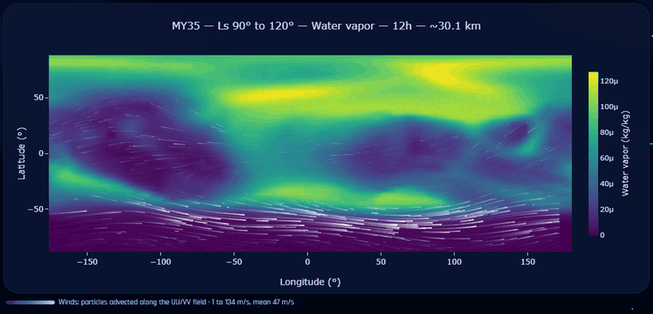

# Mars Climate Viewer

[](https://github.com/ludvdber/MCV/actions/workflows/ci.yml)
[](https://scorecard.dev/viewer/?uri=github.com/ludvdber/MCV)
[](https://github.com/ludvdber/MCV/actions/workflows/github-code-scanning/codeql)
[](https://github.com/ludvdber/MCV/releases/latest)
[](LICENSE)
[](https://github.com/ludvdber/MCV)
[](https://adoptium.net/)
[](https://mars.ludovdb.be)

*Version française : [README.fr.md](README.fr.md)*

Mars Climate Viewer opens the Martian atmosphere in a browser. It serves the
GEM-Mars climate model of the Royal Belgian Institute for Space Aeronomy
(BIRA-IASB) as maps, vertical profiles, cross-sections and diurnal animations,
reading the institute's NetCDF files where they already sit: nothing is
duplicated, converted or pre-rendered.

**Try it on [mars.ludovdb.be](https://mars.ludovdb.be)** : no account, no install.


Eleven visualization types, a console that ties up to four views together,
exports in CSV, PNG, SVG and NetCDF, permalinks that reproduce a figure exactly,
and an interface in five languages.

Files are **read partially**: every request reads only the slice, timestep or
level it needs, so a multi-terabyte archive stays where it is and costs a few
kilobytes of disk I/O per view.

| Component | Stack |
|---|---|
| Backend | Spring Boot 4.1, Java 21, NetCDF-Java (cdm-core 5.9), Gradle 9 |
| Frontend | React 19, Vite 8, Plotly.js, Three.js, MUI 9, i18next |

---

## Visualizations

| View | Route | Shows |
|---|---|---|
| Slice 2D | `/slice` | lat/lon map at one time step and altitude level |
| Animation | `/animation` | full diurnal cycle, 48 frames |
| Time series | `/timeseries` | one variable over the day at a single point |
| Vertical profile | `/profile` | one variable over the whole air column |
| Cross-section | `/crosssection` | altitude × latitude (meridional) or × longitude (zonal) |
| Zonal mean | `/zonalmean` | longitudinal average, altitude × latitude |
| Hovmöller | `/hovmoller` | space × time diagram |
| Temporal profile | `/temporal-profile` | altitude × local time above one point |
| Wind rose | `/windrose` | wind direction/speed distribution at a point |
| Difference | `/difference` | anomaly map between two datasets |
| Explore | `/explore` | console: up to 4 linked views, probe, region statistics, sessions |

All views support permalinks, CSV export, PNG/SVG export, log₁₀ scale and colorscale selection. Interfaces are available in English, French, Dutch, German and Spanish.

The Explore console holds up to four views side by side, tied together by a shared probe and a common region selection, so the same point can be read across several diagnostics at once:


On any map, winds can be drawn as **particles advected** along the UU/VV field. Trail colour and thickness follow the local speed, and the legend gives the bounds of the scale along with the field average:



In a grid, every view animates **its own** field, at its own altitude and time step: four maps side by side show four different winds, each stating its bounds under the map. A toolbar button brings the animation back to the active view only, which is the default on a phone, where four animated canvases cost a lot for thumbnail-sized maps.

---

## Requirements

| Requirement | Version | Needed for |
|---|---|---|
| **Java** | 21 or newer | running the application |
| **Node.js** | 20 or newer | building the frontend only — never required on the production server |
| **GEM-Mars data** | `.nc` files | see [Configuration](#configuration) |

---

## Install

```bash
git clone <repository-url>
cd mars-visualizer
cd frontend && npm install && cd ..
```

`./gradlew` requires no local Gradle install (wrapper included).

---

## Configuration

The application needs two data folders. Set them **before the first start**, otherwise startup fails with an explicit error naming the missing path.

| Property | Environment variable | Default | Description |
|---|---|---|---|
| `netcdf.mean.path` | `NETCDF_MEAN_PATH` | `/data/gem-mars/mean` | Folder with the averaged `.nc` files (48 local-time steps). The default is a neutral placeholder: startup fails with an explicit message until it is set |
| `netcdf.individual.path` | `NETCDF_INDIVIDUAL_PATH` | `/data/gem-mars/individual` | Folder with one subfolder per Martian year (`34/`, `35/`, …) |
| `netcdf.individual.my_base` | — | `34` | First Martian year present in that folder; later years are detected automatically |
| `server.port` | `SERVER_PORT` | `8080` | HTTP port serving both the API and the interface |
| `site.public-url` | `SITE_PUBLIC_URL` | *(empty)* | Public address of the site, used by `sitemap.xml`, `robots.txt` and the canonical / Open Graph tags. Left empty, it is derived from the request, which is already correct behind a reverse proxy. See [DEPLOYMENT.md](DEPLOYMENT.md#the-public-address-of-the-site) |
| `ratelimit.requests-per-minute` | — | `120` | Per-IP request limit |
| `ratelimit.export-per-minute` | — | `20` | Per-IP export limit (CSV/NetCDF) |
| `cors.allowed-origin` | — | `http://localhost:5173` | Only used when the frontend is served separately (dev mode) |
| `server.tomcat.remoteip.internal-proxies` | `TRUSTED_PROXIES` | loopback + private ranges | Proxies whose `X-Forwarded-For` is believed. Leave as is for a proxy on the same host or LAN; see [DEPLOYMENT.md](DEPLOYMENT.md#behind-a-reverse-proxy) |

**Network shares are supported.** In a `.properties` file `\` is an escape character, so either double every backslash or use forward slashes — both forms work for UNC paths:

```properties
netcdf.mean.path=//srv-iasb/gem-mars/mean          # UNC, forward slashes (simplest)
netcdf.mean.path=\\\\srv-iasb\\gem-mars\\mean      # UNC, escaped backslashes
netcdf.mean.path=/mnt/gem-mars/mean                # Linux NFS/CIFS mount
```

An unreachable path is detected at startup within a few seconds and the application refuses to start rather than serving an empty catalog. A file that disappears while running returns HTTP 404 for that dataset; the rest of the application keeps working.

**The catalog is built once, at startup.** A `.nc` file added while the application is running stays invisible, including to a request naming it directly: the application has to be restarted. The full procedure, including the special case of files added inside an existing subfolder of `individual/`, is in [DEPLOYMENT.md](DEPLOYMENT.md#adding-new-data).

Configuration can be supplied three ways (highest priority first): command-line arguments, environment variables, or a `config/application.properties` file next to the JAR. A commented bilingual template is provided in [`config/application.properties`](config/application.properties).

**You do not have to go looking for it.** On the first start, if no configuration exists either flat beside the JAR or in a `config/` folder, the application drops that template itself and prints its absolute path on the console. And when a path is missing or wrong, the refusal to start takes the form of a bilingual `APPLICATION FAILED TO START` block stating what is wrong on one side and what to fix on the other, with no stack trace. Both are shown in [DEPLOYMENT.md](DEPLOYMENT.md#installing).

---

## Run

### Development (hot reload)

Two servers in parallel:

```bash
./gradlew bootRun                 # backend on :8080
cd frontend && npm run dev        # frontend on :5173, proxies /api to :8080
```

Open http://localhost:5173.

Your machine's data paths belong in `config/application-local.properties`, an unversioned file that `config/application.properties` imports automatically. It saves editing the shipped configuration template, which should only ever hold neutral example paths:

```properties
netcdf.mean.path=D:/mars-data/mean
netcdf.individual.path=D:/mars-data/individual
```

### Production (single JAR)

```bash
./gradlew build                                    # compiles frontend + backend, runs tests
java -jar build/libs/mars-visualizer-0.0.1-SNAPSHOT.jar
```

The JAR contains the interface and the API; open http://localhost:8080.

### Launch parameters

Any property can be passed on the command line with `--<property>=<value>`, or as an environment variable:

```bash
# Custom port and data paths
java -jar mars-visualizer.jar \
  --server.port=9000 \
  --netcdf.mean.path=//srv-iasb/gem-mars/mean \
  --netcdf.individual.path=//srv-iasb/gem-mars/individual

# Same thing with environment variables
SERVER_PORT=9000 \
NETCDF_MEAN_PATH=/mnt/gem-mars/mean \
NETCDF_INDIVIDUAL_PATH=/mnt/gem-mars/individual \
java -jar mars-visualizer.jar

# Verbose logs for a first deployment
java -jar mars-visualizer.jar --logging.level.com.mars.visualizer=DEBUG

# Bind to a single interface (behind a reverse proxy)
java -jar mars-visualizer.jar --server.address=127.0.0.1
```

Server installation, systemd service and reverse-proxy setup: **[DEPLOYMENT.md](DEPLOYMENT.md)**.

---

## REST API

All endpoints answer JSON and validate their parameters (HTTP 400 with a localized message on an invalid value, 404 on an unknown dataset).

| Endpoint | Description |
|---|---|
| `GET /api/catalog` | MEAN dataset catalog |
| `GET /api/catalog/individual` | Individual Martian year catalog |
| `GET /api/data/slice` | 2D lat/lon grid |
| `GET /api/data/timeseries` | 48 values at a point |
| `GET /api/data/animation` | 48 frames for the diurnal cycle |
| `GET /api/data/profile` | Vertical profile at a point |
| `GET /api/data/crosssection` | Meridional or zonal cross-section |
| `GET /api/data/zonalmean` | Zonal mean (altitude × latitude) |
| `GET /api/data/hovmoller` | Hovmöller diagram (space × time) |
| `GET /api/data/temporal-profile` | Temporal profile (altitude × time) |
| `GET /api/data/difference` | Difference between two datasets |
| `GET /api/data/wind` | Sub-sampled wind field (UU/VV) |
| `GET /api/data/windrose` | Wind rose at a point |
| `GET /api/data/transect` | Great-circle transect between two points |
| `GET /api/data/tides` | Thermal tides (diurnal and semi-diurnal harmonics) |
| `GET /api/data/altitudes` | Altitude levels available for a variable |
| `GET /api/export/csv/*` | CSV export per view type |
| `GET /api/export/netcdf/slice` | NetCDF export of a slice |

Common parameters: `dataset` (catalog id), `variable` (scientific code, e.g. `TT`, `H2O`, `P0`), `time` (0–47, local-time index in half hours), `altitude` (0–102, model level index), `latitude` (−90…90), `longitude` (−180…180).

Example:

```bash
curl "http://localhost:8080/api/data/slice?dataset=<id>&variable=TT&time=24&altitude=49"
```

---

## Build and test

| Command | Effect |
|---|---|
| `./gradlew bootRun` | Backend on :8080 (rebuilds the frontend first) |
| `./gradlew build` | Frontend, compilation, tests, JAR in `build/libs/` |
| `./gradlew bootJar` | JAR only, no tests |
| `./gradlew test` | JUnit 5 suite and coverage report |
| `cd frontend && npm run dev` | Vite dev server on :5173, hot reload |
| `cd frontend && npm run test` | Vitest suite (jsdom) |
| `cd frontend && npm run test:e2e` | End-to-end suite in a real Chromium |
| `cd frontend && npm run lint` | ESLint check |

What each suite proves, what it cannot see, the coverage figures and the
continuous integration setup: **[docs/DEVELOPMENT.md](docs/DEVELOPMENT.md)**.

---

## Documentation

| File | Content |
|---|---|
| [DEPLOYMENT.md](DEPLOYMENT.md) | Server installation, systemd service, reverse proxy |
| [docs/DEVELOPMENT.md](docs/DEVELOPMENT.md) | Test suites, coverage, continuous integration |
| [CHANGELOG.md](CHANGELOG.md) | What each released version contains, and what it fixed |
| [config/application.properties](config/application.properties) | Commented configuration template |
| [deploy/](deploy/) | Ready-to-copy systemd unit and Nginx block, with the three network variants |

---

## License and reuse

Released under the [MIT license](LICENSE), © 2026 Ludovic Vanden Berghe.

You may use, modify and redistribute this code, including commercially, on one
condition: the copyright notice and the licence text travel with it. In
practice, keep the `LICENSE` file in any copy or substantial portion of the
source.

If you build something on top of it, a link back to
[github.com/ludvdber/MCV](https://github.com/ludvdber/MCV) is not required, but
it is always appreciated.

GEM-Mars data produced by the Royal Belgian Institute for Space Aeronomy
(BIRA-IASB).
